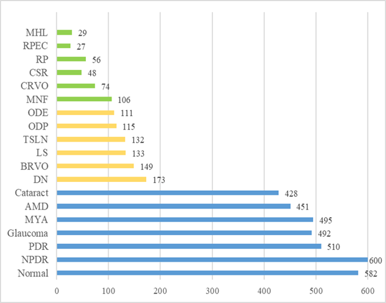
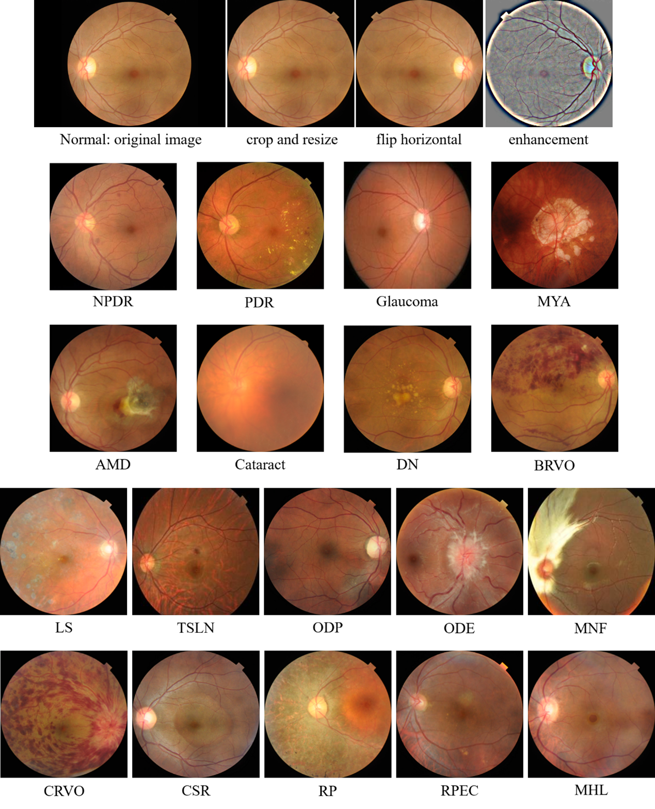

# Discriminative ensemble meta-learning with co-regularization for rare fundus diseases diagnosis

[[`Paper`](https://doi.org/10.1016/j.media.2023.102884)]

> Deep neural networks (DNNs) have been widely applied in the medical image community, contributing to automatic ophthalmic screening systems for some common diseases. However, the incidence of fundus diseases patterns exhibits a typical long-tailed distribution. In clinic, a small number of common fundus diseases have sufficient observed cases for large-scale analysis while most of the fundus diseases are infrequent. For these rare diseases with extremely low-data regimes, it is challenging to train DNNs to realize automatic diagnosis. In this work, we develop an automatic diagnosis system for rare fundus diseases, based on the meta-learning framework. The system incorporates a co-regularization loss and the ensemble-learning strategy into
the meta-learning framework, fully leveraging the advantage of multi-scale hierarchical feature embedding. We initially conduct comparative experiments on our newly-constructed lightweight multi-disease fundus images dataset for the few-shot recognition task (namely, FundusData-FS). Moreover, we verify the cross-domain transferability from miniImageNet to FundusData-FS, and further confirm our method’s good repeatability. Rigorous experiments demonstrate that our method can detect rare fundus diseases, and is superior to the state-of-the-art methods. These investigations demonstrate that the potential of our method for the real clinical practice is promising.

## Dataset
We originally re-constructed a fundus images dataset, namely FundusData-FS, for few-shot learning recognition task. FundusData-FS consists of 19 different fundus diseases or symptoms and can be found at [[`website`](https://drive.google.com/drive/folders/1zALhjo9nhSsApfteUGL4a0ClQLsovOl3?usp=sharing)]. The following figure displays the data distribution plot across all classes. The X-axis represents the number of fundus images and the Y-axis represents the categories of fundus diseases/symptoms. Notably, the blue, yellow, and green bars are for the meta-training set, meta-validation set, and meta-test set, respectively.

The following figure demonstrates the examples of images from each targeted fundus disease/symptom. Inside, the top row of the figure reports the preprocessed images sequentially.

